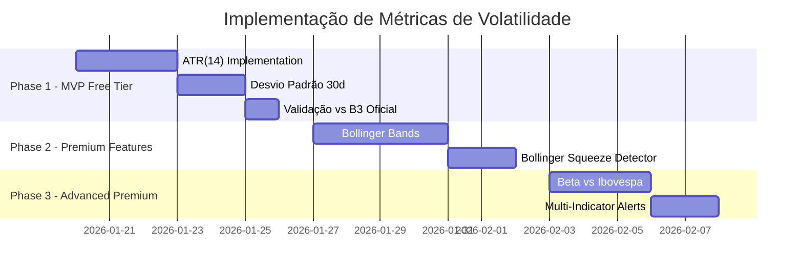

# Pesquisa de Métricas de Volatilidade - Sistema de Alertas B3

**Data:** 2026-01-17
**Pesquisador:** @domain-researcher
**Projeto:** Sistema de Alertas de Volatilidade para B3 (Freemium)

---

## 📊 Resumo Executivo

Foram analisadas **6 métricas de volatilidade** considerando:
- ✅ Facilidade de cálculo com dados gratuitos
- ✅ Utilidade para day traders e swing traders
- ✅ Adequação ao mercado brasileiro (B3)
- ✅ Custo computacional para tempo real
- ✅ Interpretabilidade para usuários não-técnicos

**Recomendação Principal:**
- **Free Tier:** ATR + Desvio Padrão Histórico
- **Premium Tier:** + Bollinger Bands + Beta vs Ibovespa

---

## 🎯 Métricas Analisadas

### ✅ Recomendadas para FREE TIER

| Métrica | Complexidade | Dados Necessários | Custo Computacional | User-Friendly |
|---------|--------------|-------------------|---------------------|---------------|
| **ATR (Average True Range)** | 🟢 Baixa | OHLC apenas | 🟢 Baixo | ⭐⭐⭐⭐⭐ |
| **Desvio Padrão Histórico** | 🟢 Baixa | Preços fechamento | 🟢 Baixo | ⭐⭐⭐⭐ |

#### ATR (Average True Range) - PRIORIDADE #1

**O que é:**
Mede a volatilidade média em valores absolutos (R$). Desenvolvido por J. Welles Wilder.

**Fórmula:**
```
TR = max(High - Low, |High - Prev_Close|, |Low - Prev_Close|)
ATR = Média Móvel Suavizada (SMMA) de TR (tipicamente 14 períodos)
```

**Exemplo Prático:**
```
PETR4 com ATR de R$ 0.85 = ação oscila em média R$ 0.85/dia
```

**Por que é ideal para FREE TIER:**
- ✅ Dados disponíveis em **Alpha Vantage free tier** (pré-calculado!)
- ✅ Cálculo simples: O(n) onde n=14
- ✅ Valor numérico direto: "PETR4 volatilidade R$ 0.85"
- ✅ Acionável: usuários podem usar para stop-loss
- ✅ Funciona em qualquer timeframe (1min, 1h, diário)

**Alertas Sugeridos:**
```yaml
Alta Volatilidade:
  trigger: ATR atual > 150% da média de ATR(20 dias)
  exemplo: "⚠️ PETR4: ATR R$ 1.20 (média R$ 0.80) - volatilidade elevada"

Baixa Volatilidade (Potencial Breakout):
  trigger: ATR atual < 50% da média de ATR(20 dias)
  exemplo: "🟢 VALE3: ATR R$ 0.40 (média R$ 0.85) - contração → breakout iminente?"
```

**Referências:**
- [Schwab - ATR Indicator and Volatility](https://www.schwab.com/learn/story/average-true-range-indicator-and-volatility)
- [Fidelity - ATR Guide](https://www.fidelity.com/learning-center/trading-investing/technical-analysis/technical-indicator-guide/atr)

---

#### Desvio Padrão Histórico - PRIORIDADE #2

**O que é:**
Medida estatística de dispersão dos retornos. Quanto maior, mais "nervosa" a ação.

**Fórmula:**
```
1. Retornos: r(t) = ln(P(t) / P(t-1))
2. Média: μ = Σr / n
3. Variância: σ² = Σ(r - μ)² / (n-1)
4. Desvio Padrão: σ = √σ²
5. Anualizar: σ_anual = σ_diário × √252
```

**Por que complementa ATR:**
- ✅ Dados **oficiais da B3** disponíveis para validação
- ✅ Permite comparação normalizada entre ativos (%)
- ✅ Base estatística sólida e universalmente compreendida
- ✅ Pode ser anualizado para contexto de longo prazo

**Uso:**
```
Tier Gratuito:
- Desvio Padrão 30 dias
- Percentil histórico (ex: "volatilidade no percentil 85")
- Comparação com média histórica
```

**Referências:**
- [B3 - Desvio Padrão Oficial](https://www.b3.com.br/pt_br/market-data-e-indices/servicos-de-dados/market-data/consultas/mercado-a-vista/volatilidades-dos-ativos/desvio-padrao/)

---

### 🔷 Recomendadas para PREMIUM TIER

| Métrica | Complexidade | Dados Necessários | Custo Computacional | User-Friendly |
|---------|--------------|-------------------|---------------------|---------------|
| **Bollinger Bands** | 🟡 Média | OHLC + Desvio Padrão | 🟡 Médio | ⭐⭐⭐⭐⭐ |
| **Beta (β)** | 🟡 Média | Ativo + Ibovespa | 🟡 Médio | ⭐⭐⭐ |

#### Bollinger Bands - PRIORIDADE #3

**O que é:**
3 bandas: SMA (média), Banda Superior (+2σ), Banda Inferior (-2σ).
Desenvolvido por John Bollinger (1980s).

**Cálculo:**
```
Banda Média = SMA(20) de fechamentos
Desvio Padrão (σ) = √(Σ(preço - SMA)² / 19)
Banda Superior = SMA(20) + (2 × σ)
Banda Inferior = SMA(20) - (2 × σ)
```

**Por que é valioso para PREMIUM:**
- ✅ **Bollinger Squeeze:** contração antecede movimentos fortes (comprovado)
- ✅ Visualização gráfica intuitiva
- ✅ Combina tendência + volatilidade em um indicador
- ✅ Ideal para day trading em timeframes 15min-1h

**Alertas Premium:**
```yaml
Bollinger Squeeze Breakout:
  trigger: Bandwidth < 10% E preço rompe banda superior/inferior
  exemplo: "🚀 MGLU3: Squeeze breakout confirmado - expansão de volatilidade detectada"

Reversão à Média:
  trigger: Preço > 2σ acima da banda média E ATR decrescente
  exemplo: "⚠️ ITUB4: Sobrecompra + volatilidade caindo - potencial reversão"
```

**Indicadores Derivados (Premium):**
- **Bollinger %B:** Posição relativa do preço nas bandas (0-1)
- **Bandwidth:** Largura das bandas (volatilidade absoluta)
- **Squeeze Detector:** Bandwidth < threshold histórico

**Referências:**
- [Schwab - Bollinger Bands Guide](https://www.schwab.com/learn/story/bollinger-bands-what-they-are-and-how-to-use-them)
- [StockCharts - Bollinger Squeeze Strategy](https://chartschool.stockcharts.com/table-of-contents/trading-strategies-and-models/trading-strategies/bollinger-band-squeeze)

---

#### Beta (β) vs Ibovespa - PRIORIDADE #4

**O que é:**
Mede risco sistemático - quanto o ativo se move quando o mercado se move 1%.

**Fórmula:**
```
β = Cov(R_ativo, R_Ibovespa) / Var(R_Ibovespa)
```

**Interpretação:**
```
β = 1.5  → Se Ibov sobe 1%, ativo sobe 1.5% (agressivo)
β = 1.0  → Ativo acompanha o mercado
β = 0.5  → Ativo sobe apenas 0.5% quando mercado sobe 1% (defensivo)
β < 0    → Correlação negativa (raro)
```

**Por que é útil para PREMIUM:**
- ✅ Contextualiza volatilidade em relação ao mercado
- ✅ Identifica ativos defensivos vs agressivos
- ✅ Útil para diversificação de portfólio
- ✅ Comparação setorial (beta médio do setor)

**Uso:**
```
Premium Features:
- Beta rolling 30/60/90 dias
- Comparação Beta vs setor
- Interpretação automática: "agressivo" / "defensivo" / "neutro"
- Alerta: "Beta de MGLU3 aumentou para 1.8 (vs média de 1.2)"
```

**Limitações:**
- ❌ Menos útil para day traders (foca volatilidade relativa, não absoluta)
- ❌ Requer dados do Ibovespa intraday
- ✅ Mais relevante para swing traders e investidores

**Referências:**
- [CFI - Beta Coefficient](https://corporatefinanceinstitute.com/resources/data-science/beta-coefficient/)
- [CFI - What is Beta in Finance](https://corporatefinanceinstitute.com/resources/valuation/what-is-beta-guide/)

---

### ⚠️ NÃO Recomendadas / Baixa Prioridade

#### ❌ Volatilidade Implícita - Prioridade #5 (Opcional)

**Por que NÃO é viável para FREE TIER:**
- ❌ Requer dados de **opções** (não disponível em APIs gratuitas)
- ❌ Alto custo computacional (solver Black-Scholes iterativo)
- ❌ Aplicável apenas a ativos com opções líquidas (~20 da B3)
- ❌ Complexidade de implementação muito alta

**SE implementado (futuro):**
- Tier Premium exclusivo
- Limitado aos top 20 ativos com opções líquidas
- Requer API paga (EODHD, etc.)
- Atualização a cada 15 minutos (não tempo real)

**Estimativa de Esforço:** 5-7 dias de desenvolvimento
**Status:** Considerar apenas após validação de demanda premium

---

#### ❌ VIX-like Index - NÃO Recomendado

**Por que NÃO é adequado:**
- ❌ Mede mercado como um todo (Ibovespa), não ativos individuais
- ❌ IVol-BR da B3 não está em APIs gratuitas
- ❌ Não útil para alertas de ações específicas

**Uso alternativo:** Indicador macro de mercado (não core feature)

---

## 🚀 Plano de Implementação

### Roadmap Priorizado



### Prioridade 1: ATR (2-3 dias)

**Tasks:**
1. ✅ Testar Alpha Vantage API com símbolos B3 (.SAO suffix) - 4h
2. ✅ Implementar cálculo ATR(14) para single asset (POC) - 8h
3. ✅ Implementar ATR rolling para histórico de 30 dias - 4h
4. ✅ Criar endpoint `/api/v1/volatility/{symbol}/atr` - 4h
5. ✅ Validar cálculos contra dados oficiais B3 - 8h

**Output:**
```json
GET /api/v1/volatility/PETR4/atr?period=14&interval=1m

{
  "symbol": "PETR4",
  "atr": 0.85,
  "atr_percent": 2.1,
  "avg_atr_20d": 0.65,
  "percentile": 75,
  "alert_level": "high",
  "timestamp": "2026-01-17T14:30:00Z"
}
```

### Prioridade 2: Desvio Padrão (1-2 dias)

**Tasks:**
1. ✅ Implementar cálculo de desvio padrão móvel (30 dias) - 4h
2. ✅ Anualização automática - 2h
3. ✅ Cálculo de percentil histórico - 4h
4. ✅ Criar endpoint `/api/v1/volatility/{symbol}/stddev` - 2h

### Prioridade 3: Bollinger Bands (3-4 dias)

**Tasks:**
1. ✅ Implementar Bollinger Bands (20, 2) - 8h
2. ✅ Calcular Bollinger %B e Bandwidth - 4h
3. ✅ Detector de Squeeze (Bandwidth < percentil 10) - 4h
4. ✅ Endpoint `/api/v1/volatility/{symbol}/bollinger` - 4h
5. ✅ Alertas de Breakout - 4h

### Prioridade 4: Beta (2-3 dias)

**Tasks:**
1. ✅ Obter histórico Ibovespa intraday - 4h
2. ✅ Implementar cálculo Beta rolling (60 dias) - 8h
3. ✅ Classificação automática (defensivo/neutro/agressivo) - 4h
4. ✅ Endpoint `/api/v1/volatility/{symbol}/beta` - 4h

---

## 💾 Arquitetura de Dados

### Schema TimescaleDB (Time-Series)

```sql
-- Tabela principal de OHLC
CREATE TABLE ohlc (
  time TIMESTAMPTZ NOT NULL,
  symbol VARCHAR(10) NOT NULL,
  open NUMERIC(10,2),
  high NUMERIC(10,2),
  low NUMERIC(10,2),
  close NUMERIC(10,2),
  volume BIGINT
);

SELECT create_hypertable('ohlc', 'time');

-- Tabela de ATR calculado
CREATE TABLE volatility_atr (
  time TIMESTAMPTZ NOT NULL,
  symbol VARCHAR(10) NOT NULL,
  atr NUMERIC(10,4),
  tr NUMERIC(10,4),
  period INT DEFAULT 14
);

SELECT create_hypertable('volatility_atr', 'time');

-- Continuous Aggregate para média de ATR
CREATE MATERIALIZED VIEW atr_daily_avg
WITH (timescaledb.continuous) AS
SELECT
  time_bucket('1 day', time) AS day,
  symbol,
  AVG(atr) as avg_atr,
  PERCENTILE_CONT(0.5) WITHIN GROUP (ORDER BY atr) as median_atr
FROM volatility_atr
GROUP BY day, symbol;
```

### Cache Strategy (Redis)

```redis
# ATR em tempo real (TTL 60s)
SET atr:PETR4:14:1m '{"timestamp":"2026-01-17T14:30:00Z","atr":0.85,"tr":0.72}'
EXPIRE atr:PETR4:14:1m 60

# Bollinger Bands (TTL 60s)
SET bb:VALE3:20:2:1h '{"upper":68.5,"middle":65.0,"lower":61.5,"bandwidth":10.8}'
EXPIRE bb:VALE3:20:2:1h 60

# Beta (TTL 1 dia - calculado diariamente)
SET beta:MGLU3:60:IBOV '{"beta":1.45,"r_squared":0.72}'
EXPIRE beta:MGLU3:60:IBOV 86400
```

---

## 📡 APIs de Dados - Análise

### ✅ Recomendado: Alpha Vantage

**Por que é a melhor opção:**
- ✅ ATR e Bollinger Bands **pré-calculados** (economiza CPU)
- ✅ Cobertura B3 via suffix `.SAO` (ex: `PETR4.SAO`)
- ✅ 50+ indicadores técnicos disponíveis
- ✅ Free tier: 500 calls/dia, 5 calls/minuto

**Limitações:**
- ⚠️ Delay de ~15 minutos (não é real-time)
- ⚠️ Rate limit pode ser insuficiente para 100+ ativos

**Endpoint exemplo:**
```
https://www.alphavantage.co/query?function=ATR&symbol=PETR4.SAO&interval=1min&time_period=14&apikey=YOUR_KEY
```

**Referência:** [Alpha Vantage](https://www.alphavantage.co/)

---

### 🇧🇷 Alternativa: BrAPI

**Vantagens:**
- ✅ Especializada em B3 (ações, FIIs, ETFs)
- ✅ API brasileira (documentação em PT-BR)
- ✅ Gratuita para uso razoável

**Limitações:**
- ⚠️ NÃO fornece indicadores técnicos pré-calculados
- ⚠️ Apenas dados OHLCV brutos
- ⚠️ Delay variável (~15-20 min)

**Uso:** Dados brutos OHLC, calcular ATR/Bollinger internamente

**Referência:** [BrAPI](https://brapi.dev/)

---

### 🌎 Alternativa: Twelve Data

**Vantagens:**
- ✅ Cobertura global (inclui B3)
- ✅ ATR, Bollinger, Desvio Padrão disponíveis
- ✅ Free tier: 800 calls/dia, 8 calls/minuto

**Limitações:**
- ⚠️ Cobertura B3 pode ser incompleta
- ⚠️ Delay variável

**Referência:** [Twelve Data](https://twelvedata.com/)

---

## 📚 Referências Principais

### Documentação Oficial

- [B3 - Desvio Padrão](https://www.b3.com.br/pt_br/market-data-e-indices/servicos-de-dados/market-data/consultas/mercado-a-vista/volatilidades-dos-ativos/desvio-padrao/)
- [Alpha Vantage API](https://www.alphavantage.co/)

### Guias Técnicos

- [Schwab - ATR Indicator](https://www.schwab.com/learn/story/average-true-range-indicator-and-volatility)
- [Fidelity - ATR Guide](https://www.fidelity.com/learning-center/trading-investing/technical-analysis/technical-indicator-guide/atr)
- [Schwab - Bollinger Bands](https://www.schwab.com/learn/story/bollinger-bands-what-they-are-and-how-to-use-them)
- [StockCharts - Bollinger Squeeze](https://chartschool.stockcharts.com/table-of-contents/trading-strategies-and-models/trading-strategies/bollinger-band-squeeze)

### Análises Comparativas

- [ATR vs Bollinger Bands - ALGOGENE](https://algogene.com/community/post/310)
- [Volatility Analysis - Traders Log](https://www.traderslog.com/volatility-analysis)

### Acadêmico

- [Banco Central do Brasil - Avaliando Volatilidade Diária](https://www.bcb.gov.br/pec/wps/port/wps297.pdf)

---

## ❓ Knowledge Gaps & Next Steps

### Perguntas em Aberto

1. ❓ Qual a latência **real** do Alpha Vantage para símbolos B3 em 2026?
2. ❓ Rate limit de 5 calls/min é suficiente para 50+ ativos?
3. ❓ Qual o custo de dados de opções da B3 (para vol implícita)?
4. ❓ Thresholds ideais de Bollinger Squeeze para mercado brasileiro?

### Próximos Passos (Prioritário)

- [ ] **Testar Alpha Vantage API** com PETR4.SAO, VALE3.SAO, MGLU3.SAO
- [ ] **Implementar POC de ATR** para 1 ativo em ambiente local
- [ ] **Definir thresholds de alertas** baseado em percentis históricos
- [ ] **Validar cálculos** contra dados oficiais da B3
- [ ] **Projetar schema TimescaleDB** para produção

---

## 📋 Checklist de Implementação

### Phase 1: MVP Free Tier (1-2 semanas)

- [ ] Setup Alpha Vantage API (free tier)
- [ ] Implementar ATR(14) calculation engine
- [ ] Implementar Desvio Padrão (30 dias)
- [ ] Criar endpoints REST API
- [ ] Setup TimescaleDB + Redis
- [ ] Validar vs dados oficiais B3
- [ ] Definir thresholds de alertas
- [ ] Testes unitários + integração
- [ ] Documentação de API

### Phase 2: Premium Features (2-3 semanas)

- [ ] Implementar Bollinger Bands (20, 2)
- [ ] Detector de Bollinger Squeeze
- [ ] Bollinger %B e Bandwidth
- [ ] Implementar Beta vs Ibovespa
- [ ] Multi-timeframe analysis (5min, 1h, diário)
- [ ] Alertas multi-indicador
- [ ] Dashboard de volatilidade
- [ ] Testes E2E

### Phase 3: Otimização & Escala (1-2 semanas)

- [ ] Otimização de queries TimescaleDB
- [ ] Cache strategy refinamento
- [ ] Batch processing noturno
- [ ] Monitoring & observability
- [ ] Load testing (100+ símbolos simultâneos)
- [ ] Documentação de usuário

---

**Arquivo gerado por:** @domain-researcher
**Para projeto:** Sistema de Alertas de Volatilidade B3 (proj-75602fb4)
**Data:** 2026-01-17

---

## 💡 Dica Final

> **Para day traders:** ATR + Bollinger Bands combinados são a estratégia profissional.
> **Para swing traders:** Adicione Beta para contexto de mercado.
> **Para tier gratuito:** ATR sozinho já fornece 80% do valor.

📖 **Documento completo em YAML:** `.agentic_sdlc/projects/proj-75602fb4/research/volatility-metrics-research.yml`
